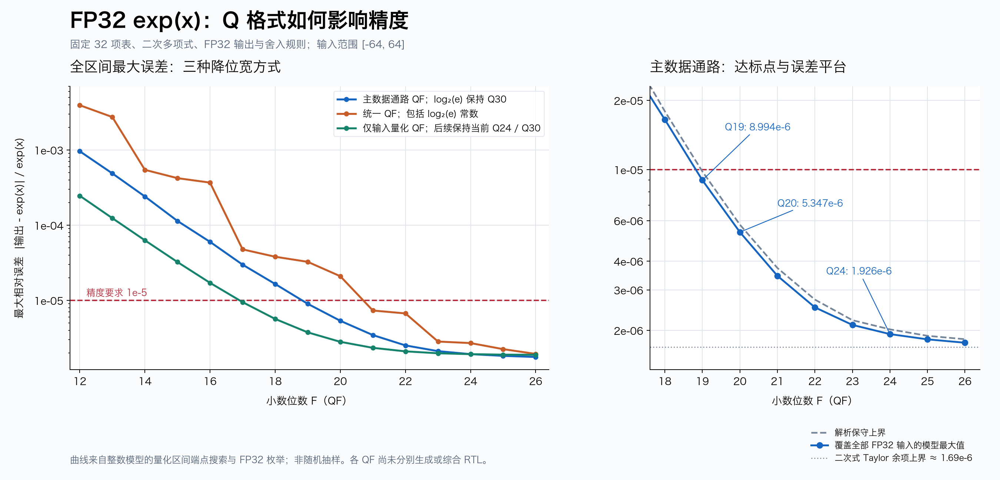

# Q 格式与 exp(x) 最大相对误差

日期：2026-09-17。当前 RTL 保持 Q24，本研究仅新增分析模型、数据和图表。



## 结论

- 主数据通路统一使用 QF、log2(e) 系数保留 Q30：本次 Q12～Q26 扫描中，Q19 首次满足 1e-5，最大相对误差为 **8.994183879e-6**。解析保守界为 **9.816118505e-6**，也低于要求。
- Q20 的最大误差为 **5.347096690e-6**，余量更大；Q18 为 **1.650062887e-5**，不满足要求。
- 连 log2(e) 常数也一起改成 QF：首次达标为 Q21，最大误差 **7.327653621e-6**。可见相同的 Q 名称必须说明究竟改变了哪些节点。
- 仅改变输入量化、保留后续 Q24 和 log2(e) Q30：首次达标为 Q17，最大误差 **9.462908406e-6**。这个结果不意味着整个数据通路都能采用 Q17。
- 当前 Q24 的全区间模型最大值是 **1.926075618e-6**，最坏输入 `0x3d314b3f`，即 `0.043284650892019272`，输出 `0x3f85a96e`。此前 454,400 个样本测得的 1.880847190e-6 是样本最大值。新增最坏输入已单独通过当前 RTL 验证。
- 提高到 Q25、Q26 后收益变小，因为 32 项表与二次 Taylor 多项式的近似误差逐渐占主导；虚线 1.694e-6 是 Taylor 余项的上界参照，不是一个严格的总误差下界。

## 每条曲线改变了什么

QF 表示 F 位小数，不是固定总位宽。整数位随所需范围配置，所有中间积保留全精度后再取位。FP32 输入、输出、输入范围 [-64,64]、32 项表、二次多项式、向零输入量化与内部向下截断策略均不变。

| 曲线 | 输入量化 | y、余量、表、多项式 | log2(e) 常数 |
|---|---|---|---|
| 蓝色 datapath | QF | QF | Q30 |
| 橙色 uniform | QF | QF | QF |
| 绿色 input_only | QF | Q24 | Q30 |

表值、ln(2)、ln(2)^2/2 系数按相应小数位数重新最近舍入，不是直接对 Q24 常数截位。log2(e) 同样按其指定小数位数重新舍入。
最终输出使用 FP32 最近偶数舍入；F≤23 的定点尾数可精确表示为 FP32，无最终尾数舍入误差；F>23 时显式最近偶数舍入。

## 为什么可以覆盖全部 FP32 输入

共有 **2,231,369,730** 个合法 FP32 位编码，包括正负零。
输入幅值先量化为整数 `n=floor(abs(x)×2^Fx)`；对固定 n，后续全部输出都是常数。
因此对区间 `[n×2^-Fx, (n+1)×2^-Fx)` 内的输入，输出 y 固定，`y/exp(x)-1` 随 x 单调，其绝对值的最大值必出现在区间两端的可表示 FP32 输入。

实现分两段：

1. n<2^24 时，两条量化边界都能被 FP32 精确表示。检查下端点及上边界的前一个 FP32 数，并对正负两种符号分别检查；第一个区间同时覆盖次正规数和零。
2. 从幅值 `2^(24-Fx)` 开始，FP32 间距已大于等于量化步长，逐个枚举剩余的 FP32 幅值直到 64。若该阈值超出 64，则只需量化区间检查及 ±64。

两部分无遗漏地覆盖全部合法输入。跳过的是已由端点单调性控制的区间内部，并非随机抽样。
最大值用 binary64 的 exp 参考搜索，最终 45 个最坏点还用 Python Decimal 70 位精度复算；误差数值与 binary64 结果差异小于 4e-16。这里的“最大”指该定点算法模型在全部约定 FP32 输入上的数值搜索结果，不是全部 Q 类型都已完成 RTL 验证或形式化验证。

C 模型的 Q24 配置与原 454,400 个 RTL 验证向量逐位一致；另有 440,678 个输入与独立 Python 参数化模型核对。当前 Q24 新发现的最坏输入经原 testbench 单独验证通过。

## 理论误差上界

令 qx=2^-Fx、qy=2^-Fy、L=ln(2)、C=round(2^Fc/L)/2^Fc：

    D = qx/L + 64×|C-1/L| + qy
    Erange = exp(LD)-1
    H = (1/32)×(qy/2 + (1/32)×qy/2 + qy) + qy
    B = (L/32)^3/6
    Pmax = 1 + L/32 + (L/32)^2/2
    A = B + H + (qy/2)×(Pmax+H) + qy
    R = 0（Fy≤23），否则 2^-24
    Etotal ≤ Erange + (1+Erange)×(A+R)

`plot_results.py` 为每个配置计算上界，并检查搜索值不超过上界。注意降低输入或中间数精度，和降低 log2(e) 系数精度，是两种不同误差来源。

## 硬件位宽含义

以蓝色曲线为例，保持 log2(e) Q30：

| 项目 | Q19 | Q20 | 当前 Q24 |
|---|---:|---:|---:|
| 输入幅值位宽 | 26 | 27 | 31 |
| 范围缩减常数乘法 | 26×31 | 27×31 | 31×31 |
| 多项式常数乘法 | 14×17 | 15×18 | 19×22 |
| 多项式变量乘法 | 14×19 | 15×20 | 19×24 |
| 最终校正变量乘法 | 20×14 | 21×15 | 25×19 |
| 表逻辑位数（含常数最高位） | 32×20=640 | 32×21=672 | 32×25=800 |

统一 Q21 则可把范围缩减乘法常数缩至 22 位，但其他运算比蓝色 Q19 更宽。最终面积最优点需要结合综合比较，不能单凭 F 判断。
以上只比较数值位宽，未生成各配置的 RTL、插入流水线或测量面积/时序。现有 RTL 文件未修改。

## 数值表

| 格式 | 主数据通路改 QF，常数 Q30 | 包括常数全部 QF | 仅输入 QF |
|---|---:|---:|---:|
| Q12 | 9.604554e-04 | 3.933110e-03 | 2.459209e-04 |
| Q13 | 4.876606e-04 | 2.738274e-03 | 1.238732e-04 |
| Q14 | 2.405154e-04 | 5.436889e-04 | 6.284369e-05 |
| Q15 | 1.137205e-04 | 4.217021e-04 | 3.232757e-05 |
| Q16 | 5.994931e-05 | 3.678198e-04 | 1.708870e-05 |
| Q17 | 2.982538e-05 | 4.762693e-05 | 9.462908e-06 |
| Q18 | 1.650063e-05 | 3.801519e-05 | 5.659563e-06 |
| Q19 | 8.994184e-06 | 3.251619e-05 | 3.752224e-06 |
| Q20 | 5.347097e-06 | 2.093496e-05 | 2.809597e-06 |
| Q21 | 3.452696e-06 | 7.327654e-06 | 2.336593e-06 |
| Q22 | 2.516834e-06 | 6.702534e-06 | 2.098175e-06 |
| Q23 | 2.111262e-06 | 2.833580e-06 | 1.978966e-06 |
| Q24 | 1.926076e-06 | 2.702278e-06 | 1.926076e-06 |
| Q25 | 1.827575e-06 | 2.245626e-06 | 1.896273e-06 |
| Q26 | 1.766791e-06 | 1.938317e-06 | 1.888210e-06 |

## 文件与复现

- `sweep.c`：端点/枚举搜索及整数模型。
- `verify_models.py`：独立 Python 模型与现有 Q24 验证向量交叉检查。
- `plot_results.py`：解析误差界、70 位最坏点复算及绘图。
- `results.csv`：45 个配置的最大值、最坏输入/输出位编码和检查计数。
- `results.json`：完整结果，增加上界与 70 位复算值。
- `q_error_curves.png` / `q_error_curves.svg`：可直接使用的曲线图。

在项目根目录运行：

```sh
bash analysis/q_sweep/run.sh
```

需要 C 编译器、Python 3 和 Matplotlib（本机实际使用 Python 3.12 与 Matplotlib 3.11.2）。第一次运行若没有 `build/vectors.txt`，脚本会先调用原有 `run.sh` 生成并验证 Q24 向量，此时还需要 Icarus Verilog。
可用 `PLOT_PYTHON` 指定装有 Matplotlib 的 Python，用 `BASE_PYTHON` 指定模型检查使用的 Python。新增 Python 包安装记录见 `docs/tools.md`；全部保存在项目 `.tools/q-sweep-python/`，未修改系统 Python。
